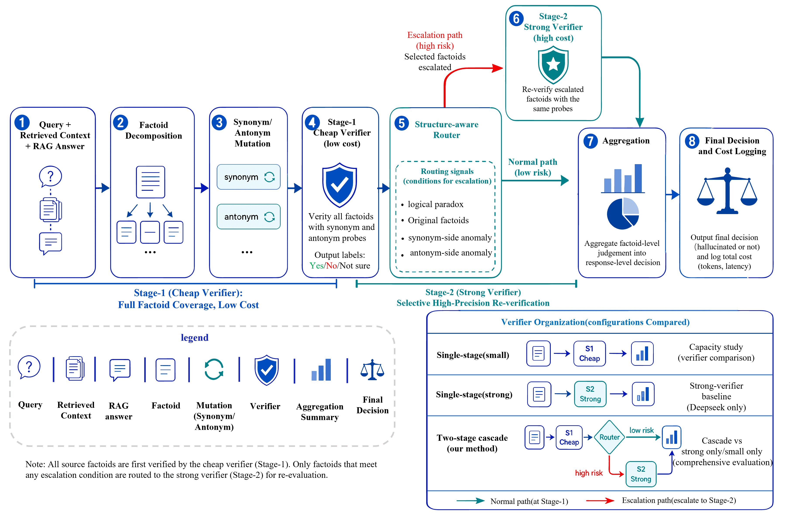

# CAVeR-MetaRAG: Cost-Aware Metamorphic Verification for Reliable Retrieval-Augmented Generation Systems





# 1. Quick Start
### Step 1: Environment
Run the following command to install the dependencies
```bash
conda create -n CAVeR-MetaRAG python=3.12.1
conda activate CAVeR-MetaRAG 

cd CAVeR-MetaRAG
pip install -r requirements.txt
```

### Step 2: Add DeepSeek API key and base url
Add your DeepSeek API key and base url by updating `./CAVeR-MetaRAG/config.py` file
```python
LLM_BASE_MAPPING = {
    "deepseek-v4-flash": [
        "deepseek-v4-flash", "https://api.deepseek.com",
        ""
    ]
}
```


### Step 3: Run with example ASQA dataset
```commandline
python main.py --experiment rq1 rq2
```

