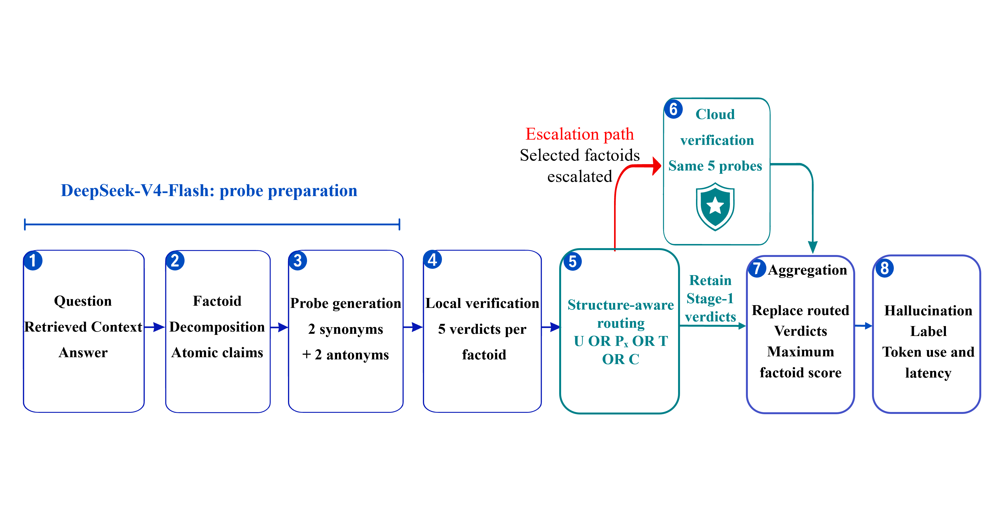

#  CAVeR-MetaRAG: Selective Cloud Escalation for Metamorphic RAG Verification


A reproducibility package for factoid-level metamorphic verification of retrieval-augmented generation answers using selective local-to-cloud escalation.



## Installation

Requires Python 3.13.

Download the complete experiment records as well as the source code. Six call
ledgers are stored with Git LFS. With Git LFS installed, use:

```bash
git clone https://github.com/Justggy567/CAVeR-MetaRAG.git
cd CAVeR-MetaRAG
git lfs pull
```

For ZIP downloads, check that the LFS-managed ledgers contain JSON records.
A file beginning with `version https://git-lfs.github.com/spec/v1` is only a
pointer and cannot be used for reproduction. Use a release archive containing
the actual LFS objects, or retrieve them with Git LFS before running.

```bash
pip install -r requirements.txt
```

## Usage

Run commands from the repository root:

```bash
python main.py --help
```

Rebuild analyses and publication tables from frozen experiment records:

```bash
python -B scripts/reproduce_all.py
```

## Repository Structure

```text
├── configs/        Experiment and analysis configurations
├── data/           Frozen datasets and construction records
├── src/caver/      Core implementation
├── scripts/        Reproduction and verification utilities
├── artifacts/      Prepared probes, run records, and results
├── figures/        Paper figures
├── release/        Data preparation and annotation audit packages
├── docs/           Method and evaluation documentation
├── tests/          Automated tests
├── main.py         Command-line entry point
└── requirements.txt
```

## Reproduction / Notes

- Offline reproduction uses existing records without model or API calls. Results are written to a new directory under `artifacts/reproduced/`.
- RQ2 remeasures the local Python routing-rule time during replay. Routing time
  and derived latency values can therefore vary slightly between runs; compare
  classification, routing decisions and token totals separately from these timings.
- Online experiments require the configured Ollama models and DeepSeek API credentials.

Run the tests:

```bash
python -B -m unittest discover -s tests
```


